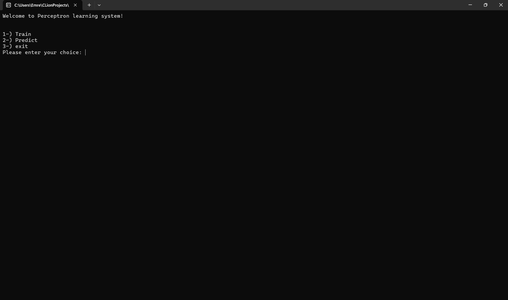
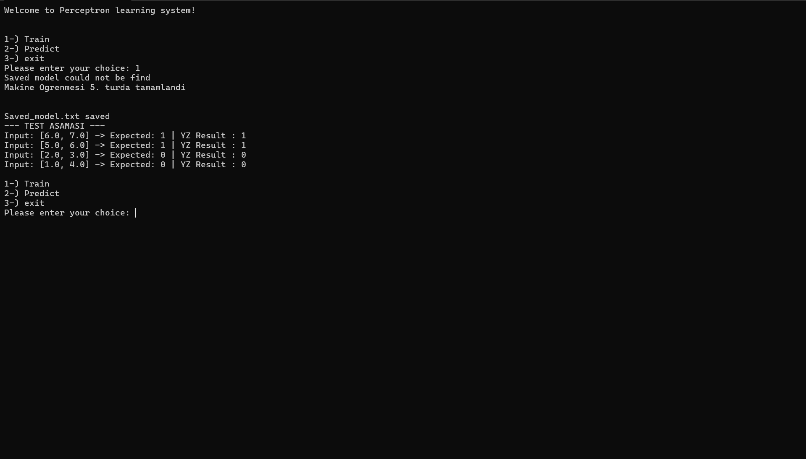
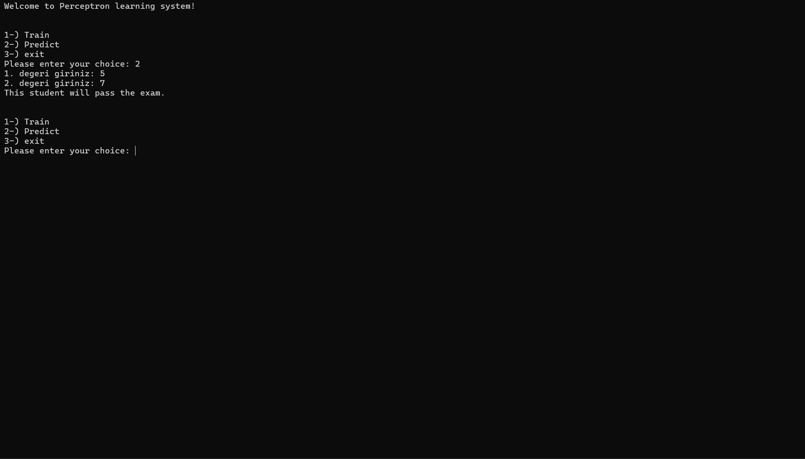
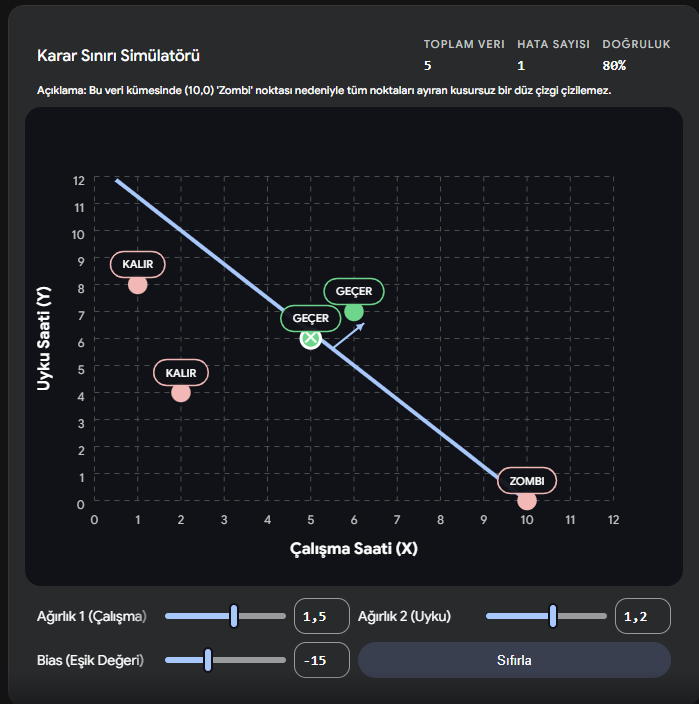

# C ile Sıfırdan Perceptron (Yapay Sinir Ağı Çekirdeği)

Bu proje, makine öğrenmesinin temellerini en alt seviyede (low-level) anlamak amacıyla saf C dili kullanılarak sıfırdan yazılmış bir Yapay Sinir Ağı (Single-Layer Perceptron) çekirdeğidir. Hiçbir harici makine öğrenmesi kütüphanesi (Keras, PyTorch vb.) kullanılmamıştır. Proje; dinamik bellek yönetimi (Memory Management), dosya işlemleri (File I/O) ve yazılım tasarım kalıplarını (Factory Pattern) sektör standartlarında uygular.
## ⚙️ Temel Özellikler ve Mimari

* **Saf C (No Dependencies):** Hiçbir harici makine öğrenmesi kütüphanesi (Keras, PyTorch vb.) kullanılmadan, sadece standart kütüphanelerle (`<stdio.h>`, `<stdlib.h>`) yazılmış bağımsız motor.
* **Dinamik Bellek Yönetimi:** `malloc` ve `free` kullanılarak Memory Leak (Bellek Sızıntısı) olmadan çalışan kurşun geçirmez bellek altyapısı.
* **Kendini Tanımlayan Veri (Self-Describing Data):** `.txt` formatında kaydedilen modellerin en üstüne "Header" verisi eklenerek, sistemin model boyutunu (`input_count`) dinamik olarak okuması ve kendini adapte etmesi.
* **Factory Pattern (Fabrika Kalıbı):** `load_model_from_file` fonksiyonu sayesinde RAM'de manuel iskelet kurmaya gerek kalmadan, doğrudan dosyadan kullanıma hazır model üretimi.
* **Transfer Learning (Aktarımlı Öğrenme):** Eski model ağırlıklarının (W1, W2, Bias) üzerine yeni veri setleriyle eğitime kaldığı yerden devam edebilme yeteneği.
* **Etkileşimli CLI (Canlı Çıkarım):** Kullanıcının terminal üzerinden canlı veriler girerek (Inference) anında tahmin alabildiği, etkileşimli komut satırı arayüzü.

### 🛡️ Hata Yönetimi ve Güvenlik Duvarları (Error Handling)

Proje, C dilinin acımasız bellek yapısına karşı özel güvenlik katmanlarıyla donatılmıştır:

* **Self-Healing (Kendi Kendini İyileştiren) Dosya Sistemi:** Eski versiyon veya hatalı bir model dosyası okunmaya çalışıldığında sistemin çökmesini engelleyen boyut kontrolü (`file_input_count != model->input_count`). Sistem uyumsuz dosyayı reddeder, sıfırdan eğitim yapar ve dosyayı yeni formatta otomatik olarak onarır.
* **Bellek Sızıntısı (Memory Leak) Koruması:** Tahmin (Predict) veya eğitim süreçleri bittikten sonra dinamik olarak açılan tüm matrislerin ve struct yapılarının `free()` ile temizlenerek işletim sistemine iade edilmesi.
* **Tip Güvenliği ve Çöp Veri (Garbage Value) Kontrolü:** RAM'deki rastgele verilerin (Garbage Value) programı sonsuz döngüye sokmasını engellemek için değişkenlere güvenli başlangıç değerlerinin atanması (`choice = 0;`) ve `double` veri kayıplarını önleyen kesin formatlayıcı (`%lf`) kullanımı.
* **Null Pointer Exception (NPE) Önlemleri:** Dosya işlemleri (`fopen`) veya veri yüklemeleri başarısız olduğunda (Örn: Model eğitilmeden test edilmeye çalışıldığında) programın Segmentation Fault verip çökmesi yerine, işlemi iptal edip güvenli bir şekilde ana menüye dönmesini sağlayan `NULL` işaretçi kontrolleri.## 🏗️ Mimari ve Teknik Altyapı (Tech Stack)

- **Geliştirme Dili:** C
- **Veri Modelleme:** Nesne yönelimli (OOP) yaklaşımı simüle eden `Struct` mimarisi ve çok boyutlu dinamik diziler.
- **Bellek Yönetimi:** Uçtan uca güvenli dinamik alan tahsisi (Çalışma anında `malloc` ile ayrılan RAM bloklarının, işlem bitiminde `free` ile sisteme iadesi).
- **Tasarım Kalıpları:** Factory Pattern (Dosya başlıklarını okuyarak kendi kendini inşa eden model üretimi).
- **Modüler Dağılım:** Kod tabanı; makine öğrenmesi motoru (`Perceptron.c`), komut satırı arayüzü (`main.c`) ve modüller arası köprü görevi gören imza dosyası (`Perceptron.h`) olarak 3 izole yapıya ayrılmıştır.

### 📚 Kullanılan Standart Kütüphaneler

Bu projede ağırlık hesaplamaları veya matris işlemleri için hiçbir dış kütüphane kullanılmamış; tüm yapay zeka matematiği C'nin temel bileşenleriyle sıfırdan yazılmıştır:

- `<stdio.h>`: Terminal üzerinden etkileşimli kullanıcı giriş/çıkışları (CLI) ve `saved_model.txt` dosyasındaki meta verilerin (Header) işlenmesi, ağırlıkların kalıcı olarak diske yazılıp/okunması (File I/O) için kullanıldı.

- `<stdlib.h>`: Girdi boyutuna göre çalışma anında (runtime) esnek bellek ayrımı yapmak (`malloc`, `free`) ve başlangıç ağırlıklarındaki (Weights/Bias) "Simetri Kırılması" kuralını uygulamak adına rastgele ondalıklı sayı (`rand`) üretiminde kullanıldı.

- **Proje İçi Başlıklar (Custom Headers):**
  - `Perceptron.h`: Yapay zekanın veri iskeletini barındıran yapıyı ve fonksiyon prototiplerini dış dünyaya (main modülüne) güvenli bir şekilde açan çekirdek başlık dosyasıdır.
## 📖 Kullanım Senaryoları ve Menü (Usage)

Sistem çalıştırıldığında etkileşimli terminal menüsü (CLI) üzerinden süreç iki ana makine öğrenmesi modülüne ayrılır ve aşağıdaki işlemler gerçekleştirilebilir:

1. **Eğitim (Train) Modülü:**
   - **Sıfırdan Öğrenme (Training):** Yapay zekanın önceden belirlenmiş veri setleri (Örn: çalışma ve uyku saatleri) üzerinden hata payını sıfırlayana kadar ağırlıklarını (Weights & Bias) güncellemesini sağlar.
   - **Aktarımlı Öğrenme (Transfer Learning):** Sistemde önceden eğitilmiş bir `saved_model.txt` dosyası varsa, eğitimi sıfırlamaz; eski tecrübeleri belleğe yükleyerek modelin üstüne koyarak ilerlemesini sağlar.
   - **Modeli Mühürleme (Save/Test):** Eğitim turu (epoch) hatasız tamamlandığında güncel katsayıları diske yedekler ve hemen ardından modeli test ederek "Beklenen Çıktı" ile "YZ'nin Çıktısı"nı karşılaştırmalı olarak ekrana basar.

2. **Canlı Tahmin (Predict / Inference) Modülü:**
   - **Dinamik Model İnşası (Factory Load):** Daha önce kaydedilmiş olan `saved_model.txt` dosyasını okur, "Header" bilgisinden modelin kaç parametreli (input_count) olduğunu anlar ve RAM'de kendi kendini otomatik olarak inşa eder.
   - **Etkileşimli Veri Girişi:** Sistem, dosyadaki modelin boyutuna göre kullanıcıya dinamik olarak *`1. degeri giriniz`, `2. degeri giriniz`* şeklinde sorular sorarak canlı dış veriyi toplar.
   - **Anlık Karar (Real-Time Inference):** Kullanıcının girdiği yeni test verilerini eğitilmiş modelin katsayılarıyla işleyerek milisaniyeler içinde kesin bir sınıflandırma sonucu (Örn: 1 -> Başarılı, 0 -> Başarısız) üretir.## 📸 Ekran Görüntüleri (Terminal Arayüzü)

### 1. Ana Menü ve Sistem Başlangıcı

### 2. Yapay Zeka Eğitim (Train) ve Test Aşaması

### 3. Etkileşimli Canlı Tahmin (Predict) Aşaması

## Çıkarılan Dersler

C programlama dili ile sıfırdan perceptron modeli kodlarken yapay zekanın temelinin tamamen matematikten oluştuğunu görmüş oldum.

Ayrıca bu projede tek bir nöronun yani tek perceptron modelinin tek başına yetersiz olduğunu da anlamış oldum, bunu şöyle anlatmak isterim:

Yaptığım bu projenin test aşamasında; 10 saat çalışıp hiç uyumayan birini teste soktuğum zaman yapay zekamıza göre bu kişi testi geçiyordu. Normal şartlarda hiç uyumadan sınava girmek düşünme yetilerimizi zayıflatacağı için gerçekte (çoğu durumda) başarısızlıkla sonuçlanır. Yapay zeka içinde bunun böyle olması gerekiyordu ama dediğim gibi yapay zeka bunu başarılı olarak sınıflandırdı.

Eğitim verilerini çoğaltarak bunu aşabileceğimi düşündüm. Verilere 8 saat çalışıp 0 saat uyuyan bir kişiyi başarısız olarak etiketledim. Böyle yaptığım zaman 100.000 tur attırsam bile yapay zeka genel bir yargıya varamadı, yani katsayıları doğru bir şekilde ayarlayamadı. Bunun sebebi tek bir perceptronun sınıflandırma yaparken verilerin arasına tek bir doğru çekmesinden kaynaklı.

Görselde göründüğü gibi başarısızları ve başarılı öğrencileri tek bir doğru ile ayıramadı.

Sonuç olarak tek bir perceptron karmaşık problemleri tek bir doğru ile ayıramadığı için Multi-Layer Perceptron gereklidir. Bu da şöyle çalışır: Tek bir doğru yerine birden fazla nöron bir araya gelerek verilerin etrafında daha karmaşık yapılar oluşturur.

Benim bu projede öğrendiğim en büyük ders, tek bir nöronun sadece dümdüz bir çizgi çekebildiği, ancak hayatın bu kadar düz olmadığıydı. Katmanlı bir yapıya (Multi-Layer) geçtiğimizde ise bu doğrular birleşerek bükülmeye başlar ve zombi öğrenci gibi uç örnekleri de doğru şekilde ayırt edebilecek bir zekaya dönüşür. Bu projeyle yapay zekanın derinliklerine giden yoldaki o ilk ve en önemli sınırı kendi ellerimle çizmiş oldum.
## Yazar

  
